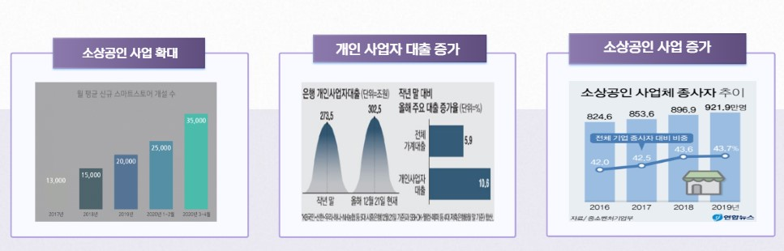
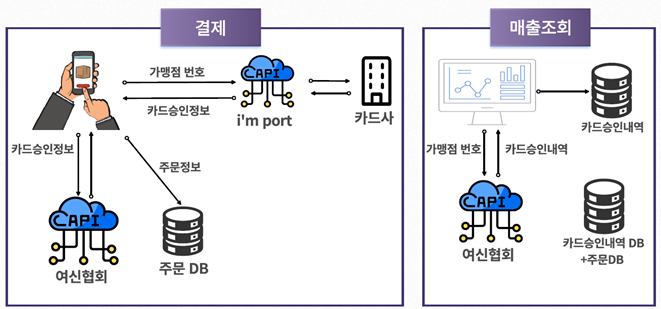
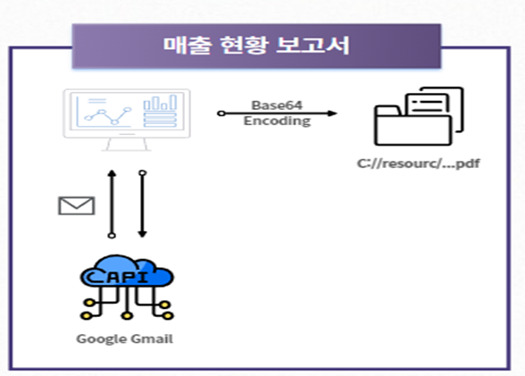
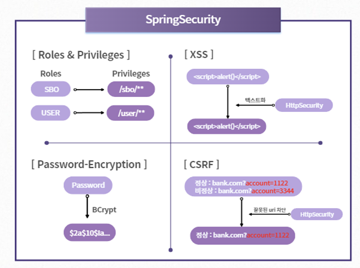
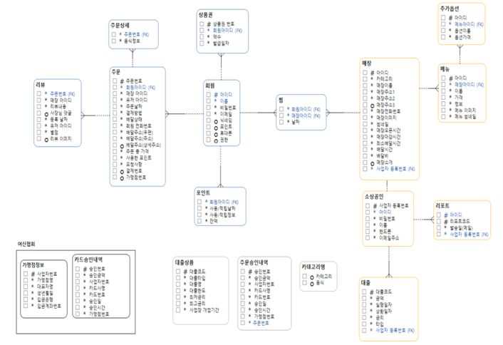
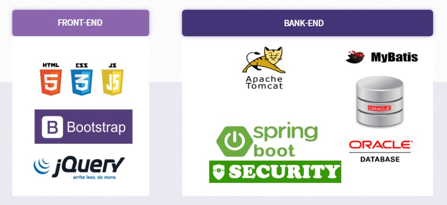
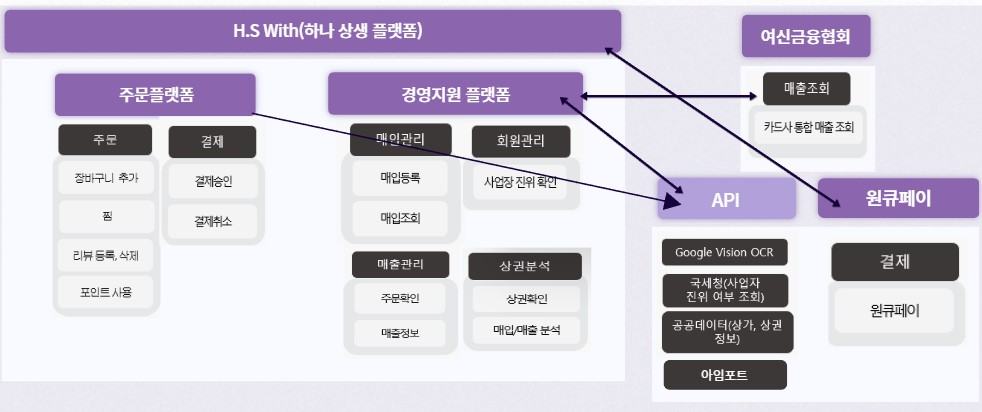

# 주문플랫폼과 소상공인 매출분석을 통한 대출혜택을 제공하는 
# 하나 H.S With(하나상생플랫폼)

[프로젝트 홈페이지 - https://github.com/koposoftware/2022_9_jcum/)

# 프로젝트 개요

4차산업혁명으로 사회 전반에서 디지털전환이 이루어지고 있습니다.
이에 소상공인들도 선택이 아닌 필수가 되어가고 있습니다. 또한,
연마다 개인사업자 수 증가, 개인 사업자 대출은 가게대출보다 월등히 많습니다. 이러한 상황에서 소상공인에게 대출혜택과 가게경영에 필요한 서비스들을 제공하기 위해 이 프로젝트를 기획하게 되었습니다.

# 프로젝트 최종 발표자료
    
   [제안발표자료](/하나상생플랫폼_최종발표.pptx) 

# 프로젝트 기능

프로젝트 제안서를 설명하세요. 발표자료와 동영상을 추가하세요. 시스템의 아키텍쳐 설명도 추가하세요.

* <h3><b>사용기술</b></h3>
Spring Boot 기반 웹 개발
Ajax,  jQuery 를 활용한 비동기 통신과 동적태그 생성
- 주문플랫폼(장바구니, 찜, 리뷰작성)
SpringSecurity를 활용한 보안강화
- 사용자 별 권한설정
- PasswordEncoder를 활용한 비밀번호 암호화
아임포트 api 를 활용한 신용카드 결제처리
WebSocket 활용
- 실시간 주문처리 및 1:1 대출상담 서비스
여신금융협회 API 서버 구축
- 연동 후 매출조회
Google Vision API OCR를 활용한 매입영수증 전산등록 처리
ApexChart.js, Chart.js 를 활용한 매입, 매출 분석 시각화 처리

<h3><b>상권분석</b></h3>
- 서울시 우리마을가게 API를 활용하여 상권이 위치한 데이터로 경영에 필요한 데이터 시각화
매출현황 보고서 이메일 발송 처리
- SpringSchduler와 pdfMake.js, Google SMTP

# 응용기술(1)
 

# 응용기술(2)
 
 
# 응용기술(3)
 
 
# 개발환경
OS : Windows11 pro
IDE : sts4(SpringToolSuite4) – Frontend + Backend
DB : Oracle 19c

# ERD
 
 
# 시스템 아키텍처
 

# 서비스 아키텍처
 

# 본인 소개

|항목|내용|설명|
|------|---|---|
|이름|엄재철||
|연락처|이메일|abctmxk@naver.com|
|학력사항|졸업(2018.02)|
|경력사항|주식회사 포스텍(2019.01.01 ~ 2021.02.24)|응용 웹 프로그램 개발 및 유지보수, 그룹사 그룹웨어 유지보수 및 개발, 그룹웨어 헬프데스크 운영
|skill set|Frontend|HTML, CSS, Javascript, jQuery
||Backend|java
|자격사항|정보처리기사|
||정보보안기사(필기)|
|교육이력|2022.03 ~ 2022.10|하나금융티아이 채용전환형 교육 1200시간( 한국폴리텍대학교 광명융합기술교육원 - 데이터분석과 )
